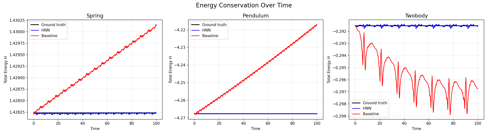
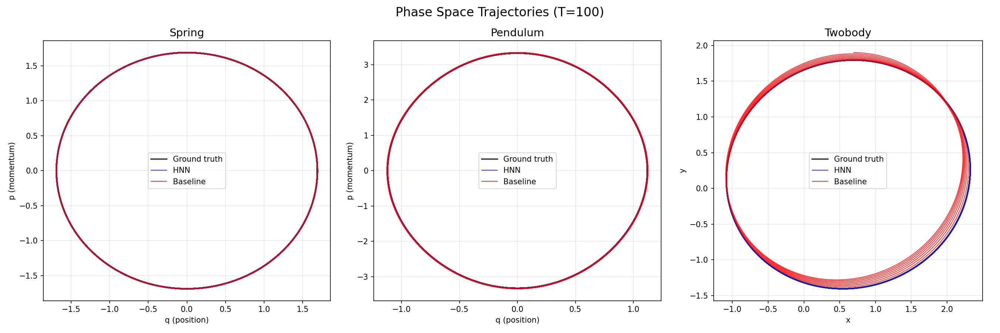
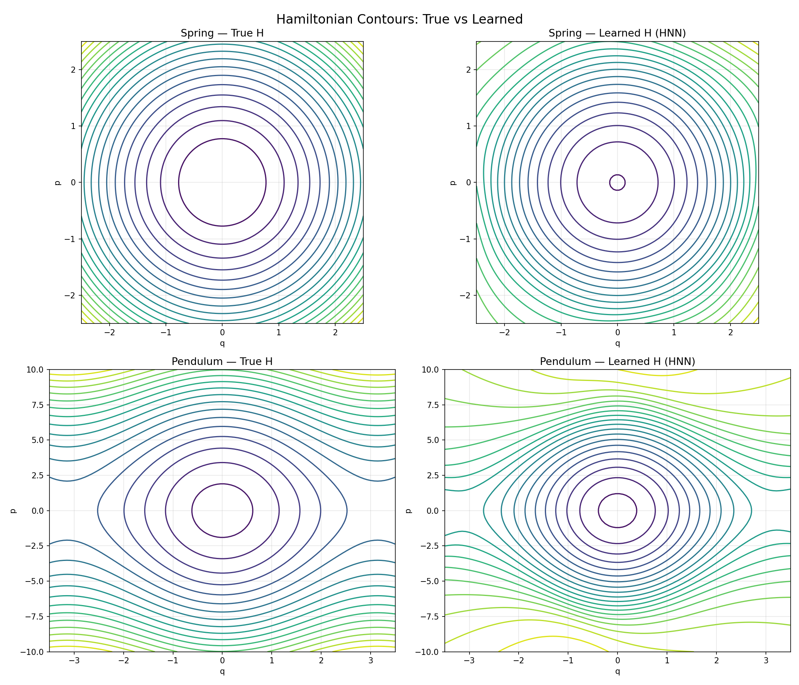

# Hamiltonian Neural Networks

A PyTorch implementation of [Hamiltonian Neural Networks](https://arxiv.org/abs/1906.01563) (Greydanus et al., NeurIPS 2019) — neural networks that learn unknown energy functions from trajectory data and conserve energy by construction.

## The Idea

Most neural networks that learn physics try to directly predict how a system evolves: given a state (q, p), predict the time derivatives (dq/dt, dp/dt). This works locally, but over long rollouts the predictions drift — orbits spiral outward, energy isn't conserved, and the model violates the laws of physics it was supposed to learn.

Hamiltonian Neural Networks take a different approach. Instead of predicting derivatives directly, the network learns a **scalar energy function** H(q, p) and uses Hamilton's equations to compute dynamics:

```
dq/dt =  ∂H/∂p
dp/dt = -∂H/∂q
```

Because the dynamics are derived from a conserved quantity via `torch.autograd`, energy conservation is **guaranteed by the architecture** — the network can't violate it even if it tries.

```
         ┌────────────────┐
(q, p) → │  MLP → H(q,p)  │ → autograd → (∂H/∂p, -∂H/∂q) → (dq/dt, dp/dt)
         └────────────────┘
              scalar
```

**This is not a PINN.** Physics-informed neural networks embed a *known* equation into the loss. HNNs learn an *unknown* energy function from data and use Hamiltonian structure as an inductive bias. It's learning physics, not solving it.

## Inspiration

The [original paper](https://arxiv.org/abs/1906.01563) is one of the most cited physics-ML papers ever, and for good reason — it's a clean demonstration that encoding the right mathematical structure into a neural network is far more powerful than throwing data at a generic architecture. I wanted to reimplement it from scratch to understand the mechanics deeply and test it on progressively harder systems.

## Systems

Three physical systems of increasing difficulty:

| System | Hamiltonian | Description |
|--------|------------|-------------|
| **Mass-spring** | H = p²/2m + kq²/2 | 1D linear harmonic oscillator |
| **Pendulum** | H = p²/2ml² - mgl·cos(q) | 1D nonlinear oscillator |
| **Two-body** | H = \|p\|²/2m - GMm/\|q\| | 2D Keplerian orbits |

For each system, training data is generated by integrating Hamilton's equations with a high-accuracy solver (DOP853, tolerance 1e-10). Both the HNN and a same-capacity baseline MLP are trained on identical data.

## Results

### Energy Conservation — The Money Plot

After training, we roll out trajectories for T=100 time units (~16 oscillation periods for the spring). The HNN (blue) maintains near-constant energy, indistinguishable from ground truth (black). The baseline (red) drifts monotonically.



| System | HNN max drift | Baseline max drift | HNN advantage |
|--------|--------------|-------------------|---------------|
| Spring | 0.000043 | 0.000526 | **12x** |
| Pendulum | 0.000372 | 0.048864 | **130x** |
| Two-body | 0.000193 | 0.032761 | **170x** |

The advantage grows with system complexity — exactly where you'd want a physics-aware architecture.

### Phase Space Trajectories

The HNN orbits (blue) trace the ground truth (black). The baseline orbits (red) precess outward over time, most visible in the two-body system where the orbit fails to close.



### Learned vs True Hamiltonian

The HNN doesn't just predict the right dynamics — it discovers the right energy landscape. Contours of the learned H match the true Hamiltonian (up to a global constant, since H is only defined up to an additive offset).



### Training Loss

Both models achieve comparable training loss — the HNN's advantage isn't from fitting the data better, it's from **what happens when you extrapolate**. The Hamiltonian structure acts as a regularizer that prevents the kind of drift that plagues unconstrained models.

## Getting Started

```bash
git clone https://github.com/your-username/hamiltonian-nn.git
cd hamiltonian-nn
pip install -r requirements.txt
```

Runs entirely on CPU (~2 min per system to train).

```bash
# Train both models on a system
python -m src.train --system spring

# Generate evaluation plots
python -m src.evaluate --system spring

# Or run the full notebook
jupyter notebook notebooks/results.ipynb

# Run tests
python -m pytest
```

## Project Structure

```
src/
├── systems.py    # Trajectory data generation (scipy integration)
├── hnn.py        # HNN: MLP → scalar H → autograd → Hamilton's equations
├── baseline.py   # Vanilla MLP baseline (direct derivative prediction)
├── train.py      # Training loop (Adam + cosine annealing, 2000 epochs)
└── evaluate.py   # Long-rollout comparison with RK4 integration
tests/
└── test_hamiltonians.py   # 17 tests
notebooks/
└── results.ipynb          # Full walkthrough with visualizations
```

## References

- Greydanus, Dzamba & Sosanya. [*Hamiltonian Neural Networks*](https://arxiv.org/abs/1906.01563). NeurIPS 2019.
